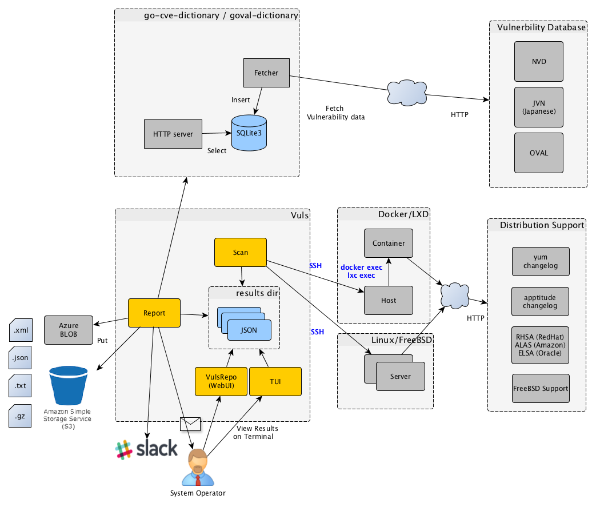

# Vuls: VULnerability Scanner

[](http://goo.gl/forms/xm5KFo35tu)

Vulnerability scanner for Linux, agentless, written in golang.

[README in English](https://github.com/future-architect/vuls/blob/master/README.md)  
Slackチームは[こちらから](http://goo.gl/forms/xm5KFo35tu)参加できます。(日本語でオッケーです)

[](https://asciinema.org/a/bazozlxrw1wtxfu9yojyihick)


----

# Abstract

毎日のように発見される脆弱性の調査やソフトウェアアップデート作業は、システム管理者にとって負荷の高いタスクである。
プロダクション環境ではサービス停止リスクを避けるために、パッケージマネージャの自動更新機能を使わずに手動更新で運用するケースも多い。
だが、手動更新での運用には以下の問題がある。
- システム管理者がNVDなどで新着の脆弱性をウォッチし続けなければならない
- サーバにインストールされているソフトウェアは膨大であり、システム管理者が全てを把握するのは困難
- 新着の脆弱性がどのサーバに該当するのかといった調査コストが大きく、漏れる可能性がある


Vulsは上に挙げた手動運用での課題を解決するツールであり、以下の特徴がある。
- システムに関係ある脆弱性のみ教えてくれる
- その脆弱性に該当するサーバを教えてくれる
- 自動スキャンのため脆弱性検知の漏れを防ぐことができる
- CRONなどで定期実行、レポートすることで脆弱性の放置を防ぐことできる


----

# Main Features

- Linuxサーバに存在する脆弱性をスキャン
    - Ubuntu, Debian, CentOS, Amazon Linux, RHELに対応
    - クラウド、オンプレミス、Docker
- OSパッケージ管理対象外のミドルウェアをスキャン
    - プログラミング言語のライブラリやフレームワーク、ミドルウェアの脆弱性スキャン
    - CPEに登録されているソフトウェアが対象
- エージェントレスアーキテクチャ
    - スキャン対象サーバにSSH接続可能なマシン1台にセットアップするだけで動作
- 設定ファイルのテンプレート自動生成
    - CIDRを指定してサーバを自動検出、設定ファイルのテンプレートを生成
- EmailやSlackで通知可能（日本語でのレポートも可能）
- 付属するTerminal-Based User Interfaceビューアでは、Vim風キーバインドでスキャン結果を参照可能
reeBSDは今のところRoot権限なしでスキャン可能
ial: Loc- サーバに存在する脆弱性をスキャン
    - FreeBSD, Ubuntu, Debian, CentOS, Amazon Linux, RHEL, Oracle Linux, SUSE Enterprise, Raspbianに対応
>>>>>>>-132432d
tuを先程セットアップしたVulsからスキャンする

----

# Tutorial: Local Scan Mode

本チュートリアルでは、Amazon EC2にVulsをセットアップし、自分に存在する脆弱性をスキャンする方法を説明する。
手順は以下の通り

1. CentOSを新規作成
1. 必要なソフトウェアをインストール
1. go-cve-dictionaryをデプロイ
1. goval-dictionaryをデプロイ
1. Vulsをデプロイ
1. 設定
1. 設定ファイルと、スキャン対象サーバの設定のチェック
1. Scan
1. Reporting
1. TUI(Terminal-Based User Interface)で結果を参照する
1. Web UI([VulsRepo](https://github.com/usiusi360/vulsrepo))で結果を参照する

## Step1. Launch CentOS7

- 今回は説明のために、脆弱性を含む古いAMIを使う
- EC2作成時に自動アップデートされるとVulsスキャン結果が0件になってしまうので、cloud-initに以下を指定してEC2を作成する。

    ```
    #cloud-config
    repo_upgrade: none
    ```

    - [Q: How do I disable the automatic installation of critical and important security updates on initial launch?](https://aws.amazon.com/amazon-linux-ami/faqs/?nc1=h_ls)

## Step2. Install requirements

Vulsセットアップに必要な以下のソフreeBSDは今のところRoot権限なしでスキャン可能
>>>>>>>+master
- go v1.- Web UI([VulsRepo](https://github.com/usiusi360/vulsrepo))を使えばピボットテーブルのように分析可能

----

# What Vuls Doesn't Do

- Vulsはソフトウェアアップデートは行わない

----

# Setup Vuls

Vulsのセットアップは以下の2パターンがある

-  Dockerコンテナ上にセットアップ  
see https://github.com/future-architect/vuls/tree/master/setup/docker  

- 手動でセットアップ  
チュートリアルでは手動でのセットアップ方法で説明する

----

# Tutorial

1. Tutorial: Local Scan Mode
      - Launch CentOS on AWS
      - Deploy Vuls
      - Scan localhost, Reporting
1. Tutorial: Remote Scan Mode
      - Launch Ubuntu Linux on AWS
      - このUbuntuを先程セットアップしたVulsからスキャンする

----

# Tutorial: Local Scan Mode

本チュートリアルでは、Amazon EC2にVulsをセットアップし、自分に存在する脆弱性をスキャンする方法を説明する。
手順は以下の通り

1. CentOSを新規作成
1. 必要なソフトウェアをインストール
1. go-cve-dictionaryをデプロイ
1. goval-dictionaryをデプロイ
1. Vulsをデプロイ
1. 設定
1. 設定ファイルと、スキャン対象サーバの設定のチェック
1. Scan
1. Reporting
1. TUI(Terminal-Based User Interface)で結果を参照する
1. Web UI([VulsRepo](https://github.com/usiusi360/vulsrepo))で結果を参照する

## Step1. Launch CentOS7

- 今回は説明のために、脆弱性を含む古いAMIを使う
- EC2作成時に自動アップデートされるとVulsスキャン結果が0件になってしまうので、cloud-initに以下を指定してEC2を作成する。

    ```
    #cloud-config
    repo_upgrade: none
    ```

    - [Q: How do I disable the automatic installation of critical and important security updates on initial launch?](https://aws.amazon.com/amazon-linux-ami/faqs/?nc1=h_ls)

## Step2. Install requirements

Vulsセットアップに必要な以下のソフトウェアをインストールする。

- SQLite3, MySQL, PostgreSQL or Redis
- git
- gcc
- GNU Make
- go v1.8.3 or later (The latest version is recommended)
    - https://golang.org/doc/install

```bash
$ ssh centos@52.100.100.100  -i ~/.ssh/private.pem
$ sudo yum -y install sqlite git gcc make wget
$ wget https://storage.googleapis.com/golang/go1.8.3.linux-amd64.tar.gz
$ sudo tar -C /usr/local -xzf go1.8.3.linux-amd64.tar.gz
$ mkdir $HOME/go
```
/etc/profile.d/goenv.sh を作成し、下記を追加する。

```bash
export GOROOT=/usr/local/go
export GOPATH=$HOME/go
export PATH=$PATH:$GOROOT/bin:$GOPATH/bin
```

カレントシェルに上記環境変数をセットする。
```bash
$ source /etc/profile.d/goenv.sh
```

## Step3. Deploy go-cve-dictionary

[go-cve-dictionary](https://github.com/kotakanbe/go-cve-dictionary)

```bash
$ sudo mkdir /var/log/vuls
$ sudo chown centos /var/log/vuls
$ sudo chmod 700 /var/log/vuls
$
$ mkdir -p $GOPATH/src/github.com/kotakanbe
$ cd $GOPATH/src/github.com/kotakanbe
$ git clone https://github.com/kotakanbe/go-cve-dictionary.git
$ cd go-cve-dictionary
$ make install
```
バイナリは、`$GOPATH/bin`以下に生成される
もしもインストールプロセスが途中で止まる場合は、Out of memory errorが発生している可能性があるので、インスタンスタイプを大きくして再実行してみてください。

NVDから脆弱性データベースを取得する。  
環境によって異なるが、AWS上では10分程度かかる。

```bash
$ cd $HOME
$ for i in `seq 2002 $(date +"%Y")`; do go-cve-dictionary fetchnvd -years $i; done
... snip ...
$ ls -alh cve.sqlite3
-rw-r--r-- 1 ec2-user ec2-user 7.0M Mar 24 13:20 cve.sqlite3
```

脆弱性レポートを日本語化したい場合は、JVNから脆弱性データベースを取得する。  

```bash
$ cd $HOME
$ for i in `seq 1998 $(date +"%Y")`; do go-cve-dictionary fetchjvn -years $i; done
```

## Step4. Deploy goval-dictionary

[goval-dictionary](https://github.com/kotakanbe/goval-dictionary)

```bash
$ mkdir -p $GOPATH/src/github.com/kotakanbe
$ cd $GOPATH/src/github.com/kotakanbe
$ git clone https://github.com/kotakanbe/goval-dictionary.git
$ cd goval-dictionary
$ make install
```
The binary was built under `$GOPATH/bin`
もしもインストールプロセスが途中で止まる場合は、Out of memory errorが発生している可能性があるので、インスタンスタイプを大きくして再実行してみてください。

今回はCentOSがスキャン対象なので、RedHatが公開しているOVAL情報を取り込む. [README](https://github.com/kotakanbe/goval-dictionary#usage-fetch-oval-data-from-redhat)

```bash
$ goval-dictionary fetch-redhat 7
```

今回はスキャン対象がCentOS 7なので、RedHat 7のOVALを取得している。
他の種類のOSをスキャンする場合は以下を参照し、スキャン対象用のOVALを取得しておくこと
- [RedHat, CentOS](https://github.com/kotakanbe/goval-dictionary#usage-fetch-oval-data-from-redhat)
- [Debian](https://github.com/kotakanbe/goval-dictionary#usage-fetch-oval-data-from-debian)
- [Ubuntu](https://github.com/kotakanbe/goval-dictionary#usage-fetch-oval-data-from-ubuntu)
- [Oracle Linux](https://github.com/kotakanbe/goval-dictionary#usage-fetch-oval-data-from-oracle)
- [SUSE](https://github.com/kotakanbe/goval-dictionary#usage-fetch-oval-data-from-suse)

## Step5. Deploy Vuls

新規にターミナルを起動し、先ほど作成したEC2にSSH接続する。
```
$ mkdir -p $GOPATH/src/github.com/future-architect
$ cd $GOPATH/src/github.com/future-architect
$ git clone https://github.com/future-architect/vuls.git
$ cd vuls
$ make install
```
The binary was built under `$GOPATH/bin`
もしもインストールプロセスが途中で止まる場合は、Out of memory errorが発生している可能性があるので、インスタンスタイプを大きくして再実行してみてください。

## Step6. Config

Vulsの設定ファイルを作成する（TOMLフォーマット）

```
$ cd $HOME
$ cat config.toml
[servers]

[servers.localhost]
host = "localhost"
port = "local"
```

## Step7. Check config.toml and settings on the server before scanning

```
$ vuls configtest
```
詳細は [Usage: configtest](#usage-configtest) を参照

## Step8. Start Scanning


```
$ vuls scan

... snip ...

One Line Summary
================
localhost       centos7.3.1611  31 updatable packages

```

## Step9. Reporting

View one-line summary

```
$ vuls report -lang=ja -format-one-line-text -cvedb-path=$PWD/cve.sqlite3 -ovaldb-path=$PWD/oval.sqlite3

One Line Summary
================
localhost       Total: 101 (High:35 Medium:50 Low:16 ?:0)       31 updatable packages

```

View short summary.

```
$ vuls report -lang=ja -format-short-text |less

localhost (centos7.3.1611)
==========================
Total: 101 (High:35 Medium:50 Low:16 ?:0)       31 updatable packages

CVE-2017-7895           10.0 HIGH (nvd)
                        Linux Kernel の NFSv2/NFSv3
                        サーバの実装におけるポインタ演算エラーを誘発される脆弱性
                        Linux Kernel の NFSv2/NFSv3
                        サーバの実装は、バッファの終端に対する特定のチェックが欠落しているため、ポイン...
                        (pointer-arithmetic error)
                        を誘発されるなど、不特定の影響を受ける脆弱性が存在します。
                        ---
                        http://jvndb.jvn.jp/ja/contents/2017/JVNDB-2017-003674.html
                        https://access.redhat.com/security/cve/CVE-2017-7895 (RHEL-CVE)
                        10.0/AV:N/AC:L/Au:N/C:C/I:C/A:C (nvd)
                        10.0/AV:N/AC:L/Au:N/C:C/I:C/A:C (jvn)
                        https://nvd.nist.gov/vuln-metrics/cvss/v2-calculator?name=CVE-2017-7895
                        6.5/CVSS:3.0/AV:N/AC:L/PR:L/UI:N/S:U/C:H/I:N/A:N (redhat)
                        https://nvd.nist.gov/vuln-metrics/cvss/v3-calculator?name=CVE-2017-7895
                        Confidence: 100 / OvalMatch

````

View full report.

```
$ vuls report -lang=ja -format-full-text |less

localhost (centos7.3.1611)
==========================
Total: 101 (High:35 Medium:50 Low:16 ?:0)       31 updatable packages

CVE-2015-2806
----------------
Max Score               10.0 HIGH (nvd)
nvd                     10.0/AV:N/AC:L/Au:N/C:C/I:C/A:C
redhat                  2.6/AV:N/AC:H/Au:N/C:N/I:N/A:P
redhat                  3.3/CVSS:3.0/AV:L/AC:L/PR:N/UI:R/S:U/C:N/I:N/A:L
CVSSv2 Calc             https://nvd.nist.gov/vuln-metrics/cvss/v2-calculator?name=CVE-2015-2806
CVSSv3 Calc             https://nvd.nist.gov/vuln-metrics/cvss/v3-calculator?name=CVE-2015-2806
Summary                 Stack-based buffer overflow in asn1_der_decoding in libtasn1 before 4.4 allows
                        remote attackers to have unspecified impact via unknown vectors.
Source                  https://nvd.nist.gov/vuln/detail/CVE-2015-2806
RHEL-CVE                https://access.redhat.com/security/cve/CVE-2015-2806
CWE-119 (nvd)           https://cwe.mitre.org/data/definitions/119.html
Package/CPE             libtasn1-3.8-3.el7 -
Confidence              100 / OvalMatch

... snip ...
```

## Step10. TUI

Vulsにはスキャン結果の詳細を参照できるイカしたTUI(Terminal-Based User Interface)が付属している。

```
$ vuls tui
```


## Step11. Web UI

[VulsRepo](https://github.com/usiusi360/vulsrepo)はスキャン結果をビボットテーブルのように分析可能にするWeb UIである。  
[Online Demo](http://usiusi360.github.io/vulsrepo/)があるので試してみて。

----

# Tutorial: Remote Scan Mode

SSHを用いてリモートのホストをスキャンする方法を説明する。

1. Ubuntu Linuxを新規に1台作成（スキャン対象）
1. スキャン対象のRemoteホストにlocalhostからSSH可能にする
1. config.tomlの設定
1. 設定ファイルと、スキャン対象サーバの設定のチェック
1. Scan
1. Reporting

先程のチュートリアルで作成したVulsサーバ(以下localhostと記述)を用いる。

## Step1. Launch new Ubuntu Linux (the server to be sacnned)

[Tutorial: Local Scan Mode#Step1. Launch Amazon Linux](#step1-launch-amazon-linux)と同じ  
[Tutorial: Local Scan Mode#Step1. Launch CentOS7](#step1-launch-centos7)のようにUbuntu Linuxを新規に作成する。
新規にターミナルを開いて今作成したEC2にSSH接続する。
$HOME/.ssh/known_hostsにリモートホストのHost Keyを追加するために、スキャン前にリモートホストにSSH接続する必要がある。

## Step2. Enable to SSH from localhost

VulsはSSHパスワード認証をサポートしてない。SSHの鍵認証の設定をしなければならない。  
localhost上でkeypairを作成し、remote host上のauthorized_keysに追加する。  

- localhost
```bash
$ ssh-keygen -t rsa
```
Copy ~/.ssh/id_rsa.pub to the clipboard.

- Remote Host
```
$ mkdir ~/.ssh
$ chmod 700 ~/.ssh
$ touch ~/.ssh/authorized_keys
$ chmod 600 ~/.ssh/authorized_keys
$ vim ~/.ssh/authorized_keys
```
Paste from the clipboard to `~/.ssh/.authorized_keys`

localhostのknown_hostsにremote hostのホストキーが登録されている必要があるので確認すること。
`$HOME/.ssh/known_hosts`にリモートホストのHost Keyを追加するために、スキャン前にリモートホストにSSH接続する必要がある。


- localhost
```
$ ssh ubuntu@172.31.4.82 -i ~/.ssh/id_rsa
```

## Step3. config.tomlの設定

- localhost
```
$ cd $HOME
$ cat config.toml
[servers]

[servers.ubuntu]
host         = "172.31.4.82"
port        = "22"
user        = "ubuntu"
keyPath     = "/home/centos/.ssh/id_rsa"
```

## Step4. Check config.toml and settings on the server before scanning

```
$ vuls configtest ubuntu
```

see [Usage: configtest](#usage-configtest)

## Step5. Start Scanning

```
$ vuls scan ubuntu
... snip ...

One Line Summary
================
ubuntu  ubuntu16.04     30 updatable packages
```

## Step6. Reporting

See [Tutorial: Local Scan Mode#Step9. Reporting](#step9-reporting)  
See [Tutorial: Local Scan Mode#Step10. TUI](#step10-tui)  
See [Tutorial: Local Scan Mode#Step11. Web UI](#step11-web-ui)

----

# Architecture

## A. Scan via SSH Mode (Remote Scan Mode)



## B. Scan without SSH (Local Scan Mode)

Vulsをスキャン対象サーバにデプロイする。Vulsはローカルホストにコマンドを発行する(SSH経由ではない）。スキャン結果のJSONを別サーバに集約する。スキャン結果の詳細化のためにはCVEデータベースへのアクセスが必要なので、事前にgo-cve-dictionaryをserver modeで起動しておく。
その集約サーバ上で、あなたはWebUIやTUIを用いて各スキャン対象サーバのスキャン結果を参照することが可能。


[詳細](#example-scan-via-shell-instead-of-ssh)

-----

## Fast Scan and Deep Scan

### Fast Scan

- Root権限不要でスキャン可能なモード（Raspbian以外）
- OVALが提供されているディストリビューションは、スキャン時はパッケージのバージョンを取得するのみ。レポート時にOVAL DBとバージョン比較により脆弱性を検知する
- OVALが提供されいていないディストリビューションはスキャン時にコマンドを発行して脆弱性を検知する

| Distribution|                             Scan Speed | Need Root Privilege |       OVAL | Need Internet Access <br>on scan tareget|
|:------------|:--------------------------------------:|:-------------------:|:----------:|:---------------------------------------:|
| CentOS      |                                   Fast |　                No |  Supported |                                      No | 
| RHEL        |                                   Fast |　                No |  Supported |                                      No |
| Oracle      |                                   Fast |　                No |  Supported |                                      No |
| Ubuntu      |                                   Fast |　                No |  Supported |                                      No |
| Debian      |                                   Fast |　                No |  Supported |                                      No |
| Raspbian    |1st time: Slow <br> From 2nd time: Fast |                Need |         No |                                    Need |
| FreeBSD     |                                   Fast |　                No |         No |                                    Need |
| Amazon      |                                   Fast |　                No |         No |                                    Need | 
| SUSE Enterprise |                               Fast |　                No |  Supported |                                      No| 

----

### Deep Scan

- Root権限が必要なコマンドも発行し、より深いスキャンを行うモード
- ChangelogをパースしてCVE-IDを検知するのでFastよりも検知漏れが減る

| Distribution|                            Scan Speed |       Need Root Privilege |      OVAL | Need Internet Access <br>on scan tareget|
|:------------|:-------------------------------------:|:-------------------------:|:---------:|:---------------------------------------:|
| CentOS      |                                  Slow |　                      No | Supported |                                    Need | 
| RHEL        |                                  Slow |　                    Need | Supported |                                    Need |
| Oracle      |                                  Slow |　                    Need | Supported |                                    Need |
| Ubuntu      |1st time: Slow <br> From 2nd time: Fast|                      Need | Supported |                                    Need |
| Debian      |1st time: Slow <br> From 2nd time: Fast|                      Need | Supported |                                    Need |
| Raspbian    |1st time: Slow <br> From 2nd time: Fast|                      Need |        No |                                    Need |
| FreeBSD     |                                  Fast |　                      No |        No |                                    Need |
| Amazon      |                                  Slow |　                      No |        No |                                    Need |
| SUSE Enterprise |                               Fast |　                     No |  Supported |                                      No| 


- On Ubuntu, Debian and Raspbian
`apt-get changelog`でアップデート対象のパッケージのチェンジログを取得し、含まれるCVE IDをパースする。
アップデート対象のパッケージが沢山ある場合、チェンジログの取得に時間がかかるので、初回のスキャンは遅い。  
ただ、２回目以降はキャッシュしたchangelogを使うので速くなる。  

- On CentOS
`yum changelog`でアップデート対象のパッケージのチェンジログを取得し、含まれるCVE IDをパースする。

- On RHEL, Oracle, Amazon and FreeBSD
`yum changelog`でアップデート対象のパッケージのチェンジログを取得する(パースはしない)。

- On SUSE Enterprise Linux
Same as fast scan mode for now.

----

# Use Cases

## Scan all servers


## Scan a single server

web/app server in the same configuration under the load balancer


----

# Support OS

| Distribution|            Release |
|:------------|-------------------:|
| Ubuntu      |          12, 14, 16|
| Debian      |             7, 8, 9|
| RHEL        |             5, 6, 7|
| CentOS      |                6, 7|
| Amazon Linux|                 All|
| FreeBSD     |              10, 11|
| SUSE Enterprise |           11, 12|
| Raspbian    |    Jessie, Stretch |

----


# Usage: Automatic Server Discovery

Discoveryサブコマンドは指定されたCIDRレンジ内でpingが返ってくるサーバを発見して、ターミナル上にVulsの設定ファイルのテンプレートを出力する。

```
$ vuls discover -help
discover:
        discover 192.168.0.0/24
```

## Example

```
$ vuls discover 172.31.4.0/24
# Create config.toml using below and then ./vuls --config=/path/to/config.toml

[slack]
hookURL      = "https://hooks.slack.com/services/abc123/defghijklmnopqrstuvwxyz"
channel      = "#channel-name"
#channel      = "${servername}"
iconEmoji    = ":ghost:"
authUser     = "username"
notifyUsers  = ["@username"]

[email]
smtpAddr      = "smtp.gmail.com"
smtpPort      = "587"
user          = "username"
password      = "password"
from          = "from@address.com"
to            = ["to@address.com"]
cc            = ["cc@address.com"]
subjectPrefix = "[vuls]"

[default]
#port        = "22"
#user        = "username"
#keyPath     = "/home/username/.ssh/id_rsa"
#cpeNames = [
#  "cpe:/a:rubyonrails:ruby_on_rails:4.2.1",
#]
#optional = [
#    ["key", "value"],
#]

[servers]

[servers.172-31-4-82]
host         = "172.31.4.82"
#port        = "22"
#user        = "root"
#keyPath     = "/home/username/.ssh/id_rsa"
#cpeNames = [
#  "cpe:/a:rubyonrails:ruby_on_rails:4.2.1",
#]
#optional = [
#    ["key", "value"],
#]
#[servers.172-31-4-82.containers]
#type = "lxd" # or "docker"
#includes = ["${running}"]
#excludes = ["container_name", "container_id"]
```

このテンプレート使ってVulsの設定ファイルを作ってもよい。

----

# Configuration

- Slack section
    ```
    [slack]
    hookURL      = "https://hooks.slack.com/services/abc123/defghijklmnopqrstuvwxyz"
    channel      = "#channel-name"
    #channel      = "${servername}"
    iconEmoji    = ":ghost:"
    authUser     = "username"
    notifyUsers  = ["@username"]
    ```

    - hookURL : Incoming webhook's URL  
    - channel : channel name.  
    channelに`${servername}`を指定すると、結果レポートをサーバごとに別チャネルにすることが出来る。
    以下のサンプルでは、`#server1`チャネルと`#server2`チャネルに送信される。スキャン前にチャネルを作成する必要がある。
      ```
      [slack]
      channel      = "${servername}"
      ...snip...

      [servers]

      [servers.server1]
      host         = "172.31.4.82"
      ...snip...

      [servers.server2]
      host         = "172.31.4.83"
      ...snip...
      ```

    - iconEmoji: emoji
    - authUser: username of the slack team
    - notifyUsers: ここにユーザ名を指定すると、Slackで通知を受け取ることができる。たとえば `["@foo", "@bar"]`を指定すると、Slackのテキストに`@foo`と`@bar`が含まれるのでスマホなどにPush通知が可能。

- Mail section
    ```
    [email]
    smtpAddr      = "smtp.gmail.com"
    smtpPort      = "587"
    user          = "username"
    password      = "password"
    from          = "from@address.com"
    to            = ["to@address.com"]
    cc            = ["cc@address.com"]
    subjectPrefix = "[vuls]"
    ```

- Default section
    ```
    [default]
    #port        = "22"
    #user        = "username"
    #keyPath     = "/home/username/.ssh/id_rsa"
    #cpeNames = [
    #  "cpe:/a:rubyonrails:ruby_on_rails:4.2.1",
    #]
    #ignoreCves = ["CVE-2016-6313"]
    #optional = [
    #    ["key", "value"],
    #]
    #[servers.172-31-4-82.containers]
    #type = "lxd" # or "docker"
    #includes = ["${running}"]
    #excludes = ["container_name", "container_id"]
    ```
    下記serversセクションで値が指定されなかった場合のデフォルト値

- servers section
    ```
    [servers]

    [servers.172-31-4-82]
    host         = "172.31.4.82"
    #port        = "22"
    #user        = "root"
    #keyPath     = "/home/username/.ssh/id_rsa"
    #cpeNames = [
    #  "cpe:/a:rubyonrails:ruby_on_rails:4.2.1",
    #]
    #ignoreCves = ["CVE-2016-6314"]
    #optional = [
    #    ["key", "value"],
    #]
    #containers = ["${running}"]
    #[servers.172-31-4-82.containers]
    #type = "lxd"
    ```

    serversセクションの値は、defaultセクションの値よりも優先される。
    defaultセクションの値を使いたい場合は `#` でコメントアウトする。

    - host: IP address or hostname of target server
    - port: SSH Port number
    - user: SSH username
    - keyPath: SSH private key path
    - cpeNames: see [Usage: Scan vulnerability of non-OS package](#usage-scan-vulnerability-of-non-os-package)
    - ignoreCves: CVE IDs that will not be reported. But output to JSON file.
    - optional: JSONレポートに含めたい追加情報
    - containers: see [Usage: Scan Docker containers](#usage-scan-docker-containers)


    Vulsは各サーバにSSHで接続するが、OSコマンドでの接続と、Goのネイティブ実装の２種類のSSH接続方法をサポートしている。
    詳細は [-ssh-native-insecure option](#-ssh-native-insecure-option) を参照。

    また、以下のSSH認証をサポートしている。
    - SSH agent
    - SSH public key authentication (with password, empty password)
    SSH Password認証はサポートしていない

----

# Usage: Configtest

```
$ vuls configtest --help
configtest:
        configtest
                        [-deep]
                        [-config=/path/to/config.toml]
                        [-log-dir=/path/to/log]
                        [-ask-key-password]
                        [-ssh-native-insecure]
                        [-containers-only]
                        [-timeout=300]
                        [-http-proxy=http://192.168.0.1:8080]
                        [-debug]

                        [SERVER]...
  -ask-key-password
        Ask ssh privatekey password before scanning
  -config string
        /path/to/toml (default "/Users/kotakanbe/go/src/github.com/future-architect/vuls/config.toml")
  -containers-only
        Test containers only. Default: Test both of hosts and containers
  -debug
        debug mode
  -deep
        Config test for deep scan mode
  -http-proxy string
        http://proxy-url:port (default: empty)
  -log-dir string
        /path/to/log (default "/var/log/vuls")
  -ssh-native-insecure
        Use Native Go implementation of SSH. Default: Use the external command
  -timeout int
        Timeout(Sec) (default 300)
```

configtestサブコマンドは、config.tomlで定義されたサーバ/コンテナに対してSSH可能かどうかをチェックする。

## Fast Scan Mode

| Distribution |            Release | Requirements |
|:-------------|-------------------:|:-------------|
| Ubuntu       |          12, 14, 16| - |
| Debian       |             7, 8, 9| reboot-notifier|
| CentOS       |                6, 7| - |
| Amazon       |                All | - |
| RHEL         |            5, 6, 7 | - | 
| Oracle Linux |            5, 6, 7 | - |
| SUSE Enterprise|            11, 12 | - |
| FreeBSD      |             10, 11 | - |
| Raspbian     |    Jessie, Stretch | - |

## Deep Scan Mode

Deep Scan Modeではスキャン対象サーバ上にいくつかの依存パッケージが必要。
configtestに--deepをつけて実行するとSSH接続に加えて以下もチェックする。
- スキャン対象のサーバ上に依存パッケージがインストールされているか
- /etc/sudoers

### Dependencies and /etc/sudoers on Target Servers

Deep Scan Modeでスキャンするためには、下記のパッケージが必要なので、手動かまたはAnsibleなどのツールで事前にインストールする必要がある。

| Distribution |            Release | Requirements |
|:-------------|-------------------:|:-------------|
| Ubuntu       |          12, 14, 16| -            |
| Debian       |             7, 8, 9| aptitude, reboot-notifier     |
| CentOS       |                6, 7| yum-plugin-changelog, yum-utils |
| Amazon       |                All | yum-plugin-changelog, yum-utils |
| RHEL         |                  5 | yum-utils, yum-security, yum-changelog |
| RHEL         |               6, 7 | yum-utils, yum-plugin-changelog |
| Oracle Linux |                  5 | yum-utils, yum-security, yum-changelog |
| Oracle Linux |               6, 7 | yum-utils, yum-plugin-changelog |
| SUSE Enterprise|            11, 12 | - |
| FreeBSD      |                 10 | -            |
| Raspbian     |     Wheezy, Jessie | -            |

また、Deep Scan Modeで利用するコマンドの中にはRoot権限が必要なものものある。configtestサブコマンドでは、スキャン対象サーバに対してそのコマンドがパスワードなしでSUDO可能な状態か確認する。また、requirettyも定義されているかも確認する。(--ssh-native-insecureオプションでscanする場合はrequirettyは定義しなくても良い)
```
Defaults:vuls !requiretty
```
For details, see [-ssh-native-insecure option](#-ssh-native-insecure-option)

スキャン対象サーバ上の`/etc/sudoers`のサンプル

- RHEL 5 / Oracle Linux 5
```
vuls ALL=(ALL) NOPASSWD:/usr/bin/yum --color=never repolist, /usr/bin/yum --color=never list-security --security, /usr/bin/yum --color=never info-security, /usr/bin/repoquery
Defaults:vuls env_keep="http_proxy https_proxy HTTP_PROXY HTTPS_PROXY"
```

- RHEL 6, 7 / Oracle Linux 6, 7
```
vuls ALL=(ALL) NOPASSWD:/usr/bin/yum --color=never repolist, /usr/bin/yum --color=never --security updateinfo list updates, /usr/bin/yum --color=never --security updateinfo updates, /usr/bin/repoquery
Defaults:vuls env_keep="http_proxy https_proxy HTTP_PROXY HTTPS_PROXY"
```

- Debian/Ubuntu/Raspbian
```
vuls ALL=(ALL) NOPASSWD: /usr/bin/apt-get update
Defaults:vuls env_keep="http_proxy https_proxy HTTP_PROXY HTTPS_PROXY"
```

- CentOS, Amazon Linux, SUSE Enterprise, FreeBSDは今のところRoot権限なしでスキャン可能
>>>>>>>-132432d
sers/kotakanbe/go/src/github.com/future-architect/vuls/oval.sqlite3")
  -ovaldb-type string
        DB type for fetching OVAL dictionary (sqlite3 or mysql) (default "sqlite3")
  -ovaldb-url string
        http://goval-dictionary.com:1324 or mysql connection string
  -pipe
        Use stdin via PIPE
  -refresh-cve
        Refresh CVE information in JSON file under results dir
  -results-dir string
        /path/to/results
  -to-azure-blob
        Write report to Azure Storage blob (container/yyyyMMdd_HHmm/servername.json/xml/txt)
  -to-email
        Send report via Email
  -to-localfile
        Write report to localfile
  -to-s3
        Write report to S3 (bucket/dir/yyyyMMdd_HHmm/servername.json/xml/txt)
  -to-slack
        Send report via Slack
```

## How to read a report

### Example

```
$ vuls report -format-full-text

172-31-4-82 (amazon 2015.09)
============================
Total: 94 (High:19 Medium:54 Low:7 ?:14)        103 updatable packages

CVE-2016-5636
-------------
Score           10.0 (High)
Vector          (AV:N/AC:L/Au:N/C:C/I:C/A:C)
Summary         Integer overflow in the get_data function in zipimport.c in CPython (aka Python)
                before 2.7.12, 3.x before 3.4.5, and 3.5.x before 3.5.2 allows remote attackers
                to have unspecified impact via a negative data size value, which triggers a
                heap-based buffer overflow.
CWE             https://cwe.mitre.org/data/definitions/190.html
NVD             https://web.nvd.nist.gov/view/vuln/detail?vulnId=CVE-2016-5636
MITRE           https://cve.mitre.org/cgi-bin/cvename.cgi?name=CVE-2016-5636
CVE Details     http://www.cvedetails.com/cve/CVE-2016-5636
CVSS Claculator https://nvd.nist.gov/cvss/v2-calculator?name=CVE-2016-5636&vector=(AV:N/AC:L/...
RHEL-CVE        https://access.redhat.com/security/cve/CVE-2016-5636
ALAS-2016-724   https://alas.aws.amazon.com/ALAS-2016-724.html
Package         python27-2.7.10-4.119.amzn1 -> python27-2.7.12-2.120.amzn1
                python27-devel-2.7.10-4.119.amzn1 -> python27-devel-2.7.12-2.120.amzn1
                python27-libs-2.7.10-4.119.amzn1 -> python27-libs-2.7.12-2.120.amzn1
Confidence      100 / YumUpdateSecurityMatch

... snip ...
```

### Summary part

```
cent6 (centos6.6)
=================
Total: 145 (High:23 Medium:101 Low:21 ?:0)      83 updatable packages
```

- `cent6` means that it is a scan report of `servers.cent6` defined in cocnfig.toml.
- `(centos6.6)` means that the version of the OS is CentOS6.6.
- `Total: 145 (High:23 Medium:101 Low:21 ?:0)` means that a total of 145 vulnerabilities exist, and the distribution of CVSS Severity is displayed.
- `83 updatable packages` means that there are 83 updateable packages on the target server.

### Detailed Part

```
CVE-2016-0702
----------------
Max Score               2.6 IMPORTANT (redhat)
nvd                     1.9/AV:L/AC:M/Au:N/C:P/I:N/A:N
redhat                  2.6/AV:L/AC:H/Au:N/C:P/I:P/A:N
jvn                     1.9/AV:L/AC:M/Au:N/C:P/I:N/A:N
CVSSv2 Calc             https://nvd.nist.gov/vuln-metrics/cvss/v2-calculator?name=CVE-2016-0702
Summary                 The MOD_EXP_CTIME_COPY_FROM_PREBUF function in crypto/bn/bn_exp.c in OpenSSL
                        1.0.1 before 1.0.1s and 1.0.2 before 1.0.2g does not properly consider
                        cache-bank access times during modular exponentiation, which makes it easier for
                        local users to discover RSA keys by running a crafted application on the same
                        Intel Sandy Bridge CPU core as a victim and - 直近1週間に更新された脆弱性情報を取得(1分未満)
>>>>>>>+master
ource                  https://nvd.nist.gov/vuln/detail/CVE-2016-0702
RHEL-CVE                https://access.redhat.com/security/cve/CVE-2016-0702
CWE-200 (nvd)           https://cwe.mitre.org/data/definitions/200.html
Package/CPE             openssl-1.0.1e-30.el6 - 1.0.1e-57.el6
Confidence              100 / OvalMatch
```

- `Max Score` means Max CVSS Score.
- `nvd` shows [CVSS Vector](https://nvd.nist.gov/CVSS/Vector-v2.aspx) of  NVD
- `redhat` shows [CVSS Vector](https://nvd.nist.gov/CVSS/Vector-v2.aspx) of RedHat OVAL
- `jvn` shows [CVSS Vector](https://nvd.nist.gov/CVSS/Vector-v2.aspx) of JVN 
- `Summary` means Summary of the CVE.
- `CWE` means [CWE - Common Weakness Enumeration](https://nvd.nist.gov/cwe.cfm) of the CVE.
- `Package` shows the package version information including this vulnerability.
- `Confidence` means the reliability of detection.
  - `100` is highly reliable
  - `YumUpdateSecurityMatch` is the method of detecting this vulnerability.
- Item list of `Confidence`

  | Detection Method       | Confidence         |  OS                              |Description|
  |:-----------------------|-------------------:|:---------------------------------|:--|
  | OvalMatch              | 100                | CentOS, RHEL, Oracle, Ubuntu, Debian, SUSE |Detection using OVAL |
  | YumUpdateSecurityMatch | 100                |               RHEL, Amazon, Oracle |Detection using yum-plugin-security|
  | ChangelogExactMatch    | 95                 | CentOS, Ubuntu, Debian, Raspbian |Exact version match between changelog and package version|
  | ChangelogLenientMatch  | 50                 |         Ubuntu, Debian, Raspbian |Lenient version match between changelog and package version| 
  | PkgAuditMatch          | 100                |                          FreeBSD |Detection using pkg audit|
  | CpeNameMatch           | 100                |                              All |Search for NVD information with CPE name specified in config.toml|


## Example: Send scan results to Slack
```
$ vuls report \
      -to-slack \
      -cvss-over=7 \
      -cvedb-path=$PWD/cve.sqlite3
```
With this sample command, it will ..
- Slack通知
- CVSS score が 7.0以上のもののみ通知


## Example: Put results in S3 bucket

事前にAWS関連の設定を行う
- S3バケットを作成 [Creating a Bucket](http://docs.aws.amazon.com/AmazonS3/latest/UG/CreatingaBucket.html)
- いずれかの方法でS3リソースへアクセスする設定を行う
    - 環境変数を設定 [Configuring the AWS Command Line Interface](http://docs.aws.amazon.com/cli/latest/userguide/cli-chap-getting-started.html)
    - Security Credentialsを設定 [Configuring the AWS Command Line Interface](http://docs.aws.amazon.com/cli/latest/userguide/cli-chap-getting-started.html)
    - サービス用のIAMロールを作成し、サービス(EC2, AWS Lambda)にアタッチ [Creating a Role to Delegate Permissions to an AWS Service](http://docs.aws.amazon.com/IAM/latest/UserGuide/id_roles_create_for-service.html)
- 環境変数、Security Credentialsを設定する場合はアクセスキーを作成する [Managing Access Keys for IAM Users](http://docs.aws.amazon.com/IAM/latest/UserGuide/id_credentials_access-keys.html)

IAMポリシーの例:

```
{
    "Version": "2012-10-17",
    "Statement": [
        {
            "Effect": "Allow",
            "Action": [
                "s3:ListAllMyBuckets"
            ],
            "Resource": "arn:aws:s3:::*"
        },
        {
            "Effect": "Allow",
            "Action": [
                "s3:PutObject"
            ],
            "Resource": "arn:aws:s3:::vuls/*"
        }
    ]
}
```

```
$ vuls scan \
      -cvedb-path=$PWD/cve.sqlite3 \
      -to-s3 \
      -format-json \
      -aws-region=ap-northeast-1 \
      -aws-s3-bucket=vuls \
      -aws-profile=default
```
この例では、
- 結果をJSON形式でS3に格納する。
  - バケット名 ... vuls
  - リージョン ... ap-northeast-1
  - 利用するProfile ... default

## Example: Put results in Azure Blob storage

事前にAzure Blob関連の設定を行う
- Azure Blob Containerを作成

```
$ vuls scan \
      -cvedb-path=$PWD/cve.sqlite3 \
      -to-azure-blob \
      -format-xml \
      -azure-container=vuls \
      -azure-account=test \
      -azure-key=access-key-string
```
この例では、
- 結果をXML形式でBlobに格納する。
  - コンテナ名 ... vuls
  - ストレージアカウント名 ... test
  - アクセスキー ... access-key-string

また、アカウント名とアクセスキーは環境変数でも定義が可能
```
$ export AZURE_STORAGE_ACCOUNT=test
$ export AZURE_STORAGE_ACCESS_KEY=access-key-string
$ vuls scan \
      -cve-dictionary-dbpath=$PWD/cve.sqlite3 \
      -report-azure-blob \
      -azure-container=vuls
```

## Example: IgnoreCves

Slack, EMail, テキスト出力しないくないCVE IDがある場合は、設定ファイルに定義することでレポートされなくなる。
ただ、JSONファイルには以下のように出力される。

- config.toml
```toml
[default]
ignoreCves = ["CVE-2016-6313"]

[servers.bsd]
host     = "192.168.11.11"
user     = "kanbe"
ignoreCves = ["CVE-2016-6314"]
```

- bsd.json
```json
[
  {
    "ServerName": "bsd",
    "Family": "FreeBSD",
    "Release": "10.3-RELEASE",
    "IgnoredCves" : [
      "CveDetail" : {
        "CVE-2016-6313",
        ...
      },
      "CveDetail" : {
        "CVE-2016-6314",
        ...
      }
    ]
  }
]
```

## Example: Add optional key-value pairs to JSON

追加情報をJSONに含めることができる。  
デフォルトセクションのkey-valueはserversセクションのもので上書きされる。  
使い方の例として、AzureリソースグループやVM名を指定しておくことで、結果のJSONをスクリプトでパースしてAzure VMの操作をする、などが可能。

- config.toml
```toml
[default]
optional = [
	["key1", "default_value"],
	["key3", "val3"],
]

[servers.bsd]
host     = "192.168.11.11"
user     = "kanbe"
optional = [
	["key1", "val1"],
	["key2", "val2"],
]
```

- bsd.json
```json
[
  {
    "ServerName": "bsd",
    "Family": "FreeBSD",
    "Release": "10.3-RELEASE",
    .... snip ...
    "Optional": [
      [  "key1", "val1" ],
      [  "key2", "val2" ],
      [  "key3", "val3" ]
    ]
  }
]
```

## Example: Use MySQL as a DB storage back-end

```
$ vuls report \
      -cvedb-type=mysql \
      -cvedb-url="user:pass@tcp(localhost:3306)/dbname?parseTime=true"
```

## Example: Use PostgreSQL as a DB storage back-end

```
$ vuls report \
      -cvedb-type=postgres \
      -cvedb-url=""host=myhost user=user dbname=dbname sslmode=disable password=password""
```

## Example: Use Redis as a DB storage back-end

```
$ vuls report \
  -cvedb-type=redis -cvedb-url="redis://localhost/0" 
  -ovaldb-type=redis  -ovaldb-url="redis://localhost/1"
```

----

# Usage: Scan vulnerability of non-OS package

Vulsは、[CPE](https://nvd.nist.gov/cpe.cfm)に登録されているソフトウェアであれば、OSパッケージ以外のソフトウェアの脆弱性もスキャン可能。  
たとえば、自分でコンパイルしたものや、言語のライブラリ、フレームワークなど。

-  CPEの検索方法
    - [NVD: Search Common Platform Enumerations (CPE)](https://web.nvd.nist.gov/view/cpe/search)  
    **Check CPE Naming Format: 2.2**

    - [go-cpe-dictionary](https://github.com/kotakanbe/go-cpe-dictionary) is a good choice for geeks.   
    ターミナル上でCPEをインクリメンタル検索出来るツール

- Configuration  
例えば、Ruby on Rails v4.2.1の脆弱性を検知したい場合は、serversセクションに以下のように定義する。
    ```
    [servers]

    [servers.172-31-4-82]
    host         = "172.31.4.82"
    user        = "ec2-user"
    keyPath     = "/home/username/.ssh/id_rsa"
    cpeNames = [
      "cpe:/a:rubyonrails:ruby_on_rails:4.2.1",
    ]
    ```


# Usage: Integrate with OWASP Dependency Check to Automatic update when the libraries are updated (Experimental)
[OWASP Dependency check](https://www.owasp.org/index.php/OWASP_Dependency_Check) は、プログラミング言語のライブラリを特定し（CPEを推測）、公開済みの脆弱性を検知するツール。

VulsとDependency Checkを連携させる方法は以下
- Dependency Checkを、--format=XMLをつけて実行する
- そのXMLをconfig.toml内で以下のように定義する

>>>>>>> 132432d
    ```
    $ go-cve-dictionary fetchjvn -week
    ```

- 脆弱性情報の自動アップデート  
Cronなどのジョブスケジューラを用いて実現可能。  
-week オプションを指定して夜間の日次実行を推奨。


## スキャン実行

```
$ vuls scan -lang=ja
```
Scan時にlang=jaを指定すると脆弱性レポートが日本語になる  
slack, emailは日本語対応済み TUIは日本語表示未対応

